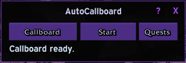
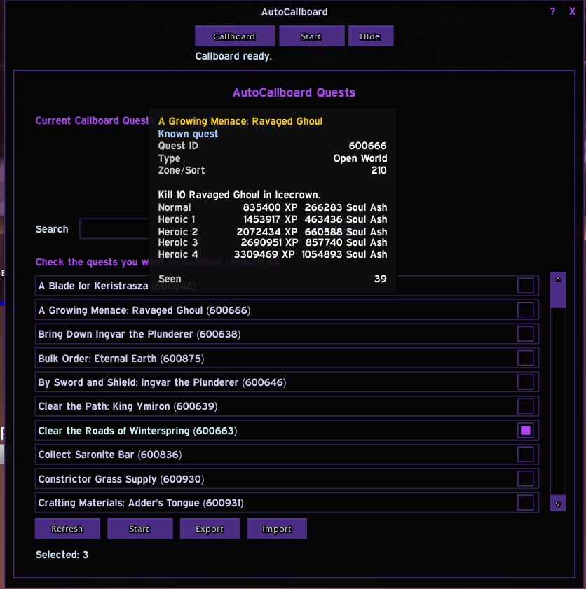

<div align="center">

# AutoCallboard

Automatic Callboard rolling for Project Ebonhold. Pick the quests you want,
open a board, and let AutoCallboard stop when one appears.

[](https://github.com/disarrayed/AutoCallboard/releases)


[**Download**](https://github.com/disarrayed/AutoCallboard/releases/latest) · [**Source**](https://github.com/disarrayed/AutoCallboard)





</div>

---

## How it works

AutoCallboard watches the Project Ebonhold objective board UI and rolls until
one of your wanted quests appears.

The normal flow:

1. Open `Quests`.
2. Check the quests you want AutoCallboard to pick.
3. Click `Start`.
4. AutoCallboard checks for board access, then reads Project Ebonhold objective data and rolls.
5. When a wanted quest appears, it selects the quest and pauses.
6. AutoCallboard records the accepted quest ID and tries to share that quest
   with your group.
7. Finish the quest, then continue when you are ready.

Use the `Callboard` button when you need to summon a board. At a normal
`Objectives Board`, click the board to open it. `Start` does not summon, and it
will not reroll or select from cached data if no board is open.

Rerolls cost gold. If you pick rare quests, AutoCallboard may roll many times, and the cost can add up fast.

---

## Features

**Wanted quests**
- Pick wanted quests from the `Quests` panel
- Wanted picks save per character
- Known quest list grows as quests appear on the Callboard
- Search by quest name or quest info
- Hover a quest to see the quest details

**Rolling**
- `Start` rolls until a wanted quest appears
- `Start` does not summon the Callboard
- `Start` will not spend a reroll unless board access is detected through UI, board gossip, or the clicked board's `npc` token/object ID
- `Share` retries the last accepted quest from your quest log
- `Auto Accept Quests` can accept quests shared by party or raid members
- Auto Accept Quests is separate from board quest auto-accept
- Auto Accept Quests does not rely on fixed quest IDs or titles
- `Stop` ends rolling at any time
- AutoCallboard selects a matched quest and pauses
- The board window closes after a quest is selected
- The loop waits while a selected quest is active
- Reroll confirm is handled automatically

**Callboard controls**
- `Callboard` casts Summon Callboard
- If an `Objectives Board` is detected, AutoCallboard uses it before falling back to `Callboard`
- Tracks Callboard active time and cooldown
- Guards reroll and quest selection when board UI/data is missing
- Minimap button opens the addon and toggles the quest panel

**Quest data**
- Learns quests from the Callboard over time
- `Export` and `Import` move known quest data between characters
- Accepted quest IDs are logged so `Share` can retry the latest accepted quest
- Copyable debug log for troubleshooting

---

## Install

1. Download the latest zip from [Releases](https://github.com/disarrayed/AutoCallboard/releases)
2. Extract to `WoW\Interface\AddOns`
3. Folder must be named `AutoCallboard`
4. Restart WoW. A `/reload` is not enough on first install.

---

## Slash commands

```text
/acb             Show the main AutoCallboard window
/acb quests      Open the quest panel
/acb callboard   Open a detected board or summon the Callboard
/acb roll        Start rolling
/acb stop        Stop rolling
/acb autoacceptquests on|off  Turn Auto Accept Quests on or off
/acb export      Export known quest data
/acb import      Import known quest data
/acb debug       Open the copyable debug log
/acb cooldown    Add cooldown details to the debug log
/acb sniff on    Record board interaction evidence in the debug log
/acb sniff       Add one interaction snapshot to the debug log
/acb etrace      Open the client event trace when available
/autocallboard   Alias for /acb
```

---

## Notes

- AutoCallboard is built for Project Ebonhold's Callboard and Objectives Board UI.
- Rerolls cost gold. Pick carefully.
- Screenshots and README files are part of the GitHub repo only. They are not included in the release zip.

---

<div align="center">
<sub>Made for the Project Ebonhold community.</sub>
</div>
